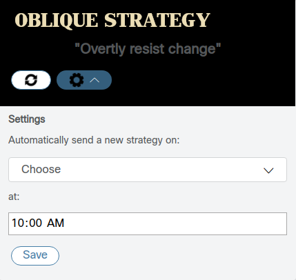

# webex-card-sample

## Overview

Implements a Webex Teams messaging bot, that can post an [adaptive card](https://adaptivecards.io/)
containing an 'oblique strategy' scraped from [http://stoney.sb.org/eno/oblique.html](http://stoney.sb.org/eno/oblique.html)].



The adaptive card features a 'refresh' button to request a new card/strategy, and a 'settings' button that opens a subcard where scheduling options can be selected (actually implementing persistence and auto-posting based on the schedule choices is left as an exercise.))  These action buttons trigger webhooks which are processed by the sample.

Note, this project uses the Webex Teams [node.js SDK](https://developer.webex.com/docs/sdks/node) for most functionality, including posting messages, creating webhooks and listening for new membership and message events.  However, the SDK does not yet implement listening for [attachment action](https://developer.webex.com/docs/api/guides/cards) events.  Therefore, the sample uses the standard Webex Teams [webhooks](https://developer.webex.com/docs/api/guides/webhooks) mechanism to create an `attachmentActions` webhook and receive inbound POST messages via [Express](https://expressjs.com/).

[Webex for Developers Site](https://developer.webex.com/)

## Getting started

- Install Node.js 10.15.0+ (should work on any version supporting async/await)  On Windows, choose the option to add to PATH environment variable

- The project was built/tested using [Visual Studio Code](https://code.visualstudio.com/)

- Clone this repo to a directory on your PC:

    ```bash
    git clone https://github.com/CiscoDevNet/webex-card-sample.git
    ```

- Dependency Installation:

    ```bash
    cd webex-card-sample
    npm install
    ```
  
- Open the project in VS Code:

    ```bash
    code .
    ```

- Create a [Webex Teams bot](https://developer.webex.com/my-apps/new) and copy the bot access token

- In VS Code:

    1. Edit `vscode/launch.json` and paste in your bot access token in the `env` area

    2. Run the sample by pressing **F5**, or by opening the Debugging panel and clicking the green 'Launch' arrow

- In your favorite Webex Teams client, add the new bot to a test space/room.

    You may also send any @message to the bot if in a group space

- After a strategy is posted, you can click on the 'refresh' icon to request another card/strategy.  You can click on 'settings' and play with the options and 'save' button, however the sample app does not implement actually saving/scheduling posts automatically

## Hints

- As the standard webhook mechanism requires that the application be accessible via a publicly available URL, this sample uses the [ngrok for node](https://www.npmjs.com/package/ngrok) package to create a reverse proxy tunnel on startup - this may have implications for your firewall/security policy.

    A production application would typically host an application like this on a cloud platform or have an IT vetted reverse proxy configured, etc.  If/when the Teams Node.js SDK implements listening for attachmentActions events, then this mechanism could be removed, relying on the websocket-based mechanism built into the other SDK listeners

- As a result of the above, any assets used in posted cards and statically served by this app (i.e. title, background and icon images) will only appear when the app is running.  Further, as the public URL of the app provided by ngrok is different on each run, the asset URLs present in previously posted cards will no longer work, even when the app is running

[](https://developer.cisco.com/codeexchange/github/repo/CiscoDevNet/webex-card-sample)